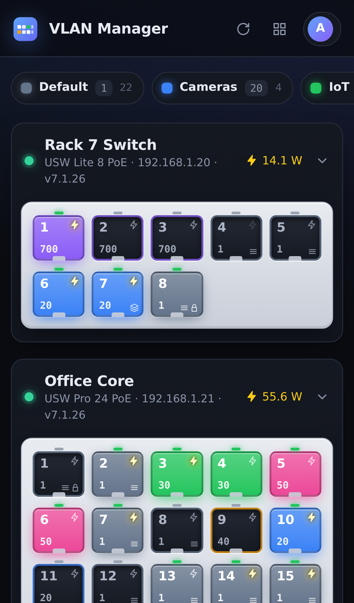
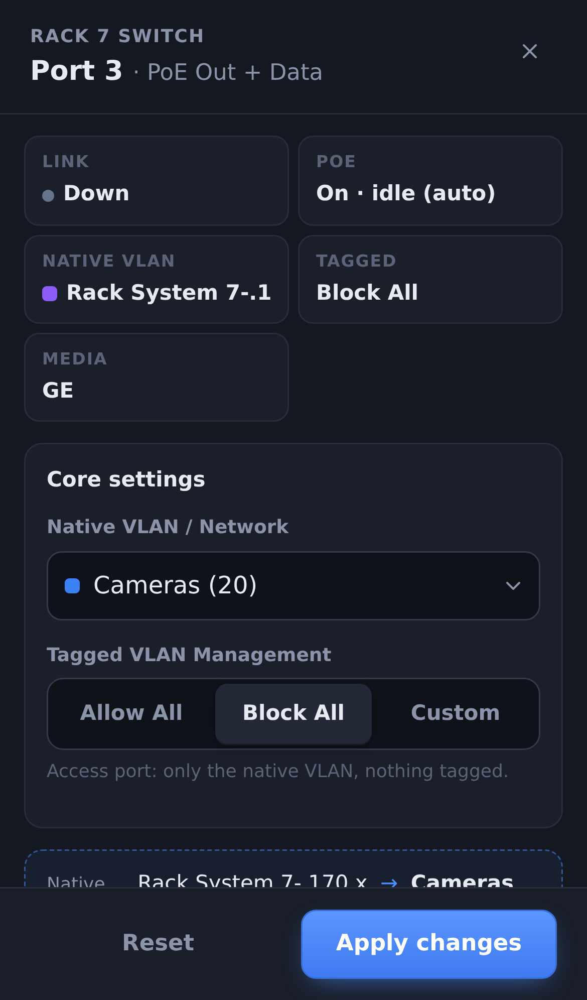
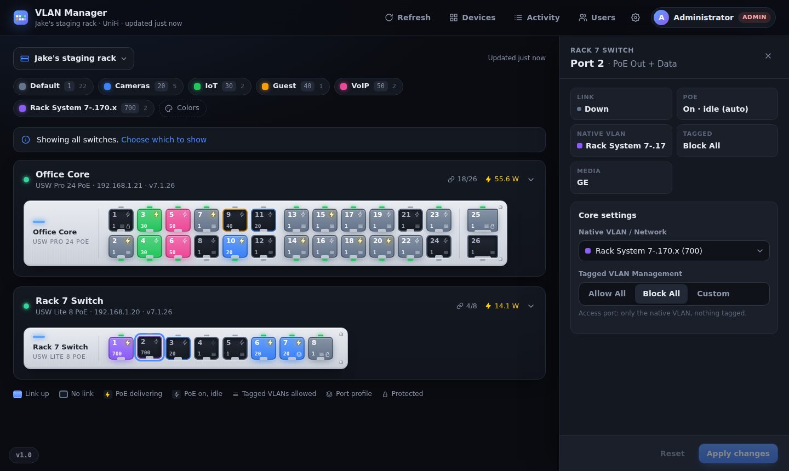
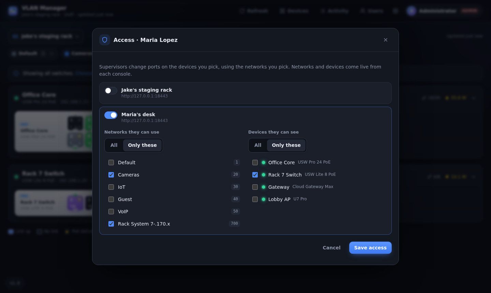

# VLAN Manager for UniFi

[](https://github.com/samschultzponsys/uos-local-vlan-manager/releases/latest)
[](https://github.com/samschultzponsys/uos-local-vlan-manager/actions/workflows/release.yml)

Set a switch port's **native VLAN** from your phone. It's a small, self-hosted web app that
talks to your UniFi consoles. Pick the switches you care about, tap a port, choose the
network, done.

The UniFi mobile app only lets you apply port *profiles*. This brings back the simple
"Native VLAN / Network" + "Tagged VLAN Management" setting, with a UI built for phones first.

One instance serves many UniFi consoles. For example, give every technician their own UniFi OS
instance for their staging rack, add each one here with its API key, and let each technician
manage only their own switches and only the VLANs you allow.

<p>
  
  
</p>



## What it does

- **Your switches, drawn like the hardware**: your name for it and UniFi's official model name
  (e.g. *USW Flex Mini* rather than `USMINI`) on the chassis, odd ports on top, even below,
  SFP cages on the right. On a phone the ports wrap into large tap targets.
- **Port status at a glance**: link up/down and speed, PoE enabled / delivering power (with
  watts), the native VLAN as the port's color and number, and a mark for what the port is:
  - **uplink**, **link to a UniFi device**, **WAN**, **LAG** or **mirror** port
  - otherwise **all VLANs tagged** or **some VLANs tagged** (Allow All / Custom)
  - port profile, admin lock

  The panel shows the port type as it is on the box, e.g. *RJ45 · 2.5 GbE* or *SFP+ · empty*.
- **Tap a port** to set:
  - **Native VLAN / Network**: a dropdown of the networks already configured in UniFi.
  - **Tagged VLAN Management**: Allow All, **Block All** (pre-selected by default) or Custom
    (tick the networks to tag).

  The change is read back from the controller to confirm it stuck.
- **Many ports at once, across switches**: Ctrl / ⌘ click to pick ports, Shift click for a
  range (by port number), or **Select ports** on a phone. One native VLAN and tagging for all
  of them, with one confirmation for protected / locked / profile ports.
- **VLAN colors**: every network has a color. Admins set the defaults and each user can pick
  their own. Tap a network in the legend to highlight every port that carries it.
- **Display options, per person**: each part of a network bubble (VLAN number, ports on it,
  connected clients, IP subnet) shown always, on hover / tap, or never; bubbles wrapped, in one
  row or a grid; and the ports drawn as tiles / faceplate, a compact grid or a list. Settings are saved to your account, so they follow you to
  any browser; the port view is kept per screen size (phone, tablet / folding phone, laptop /
  monitor, ultrawide / 4K) and picked live from the window width.
- **Safety rails**: uplinks, links to other UniFi devices, LAG and mirror ports are
  **protected**: changing one could cut off the switch or what's behind it, so it takes the
  *Change protected ports* ability and a confirmation. WAN ports can't be changed here at
  all. Ports with a port profile ask before detaching it.
- **Switches that can't filter tagged VLANs** (like the **USW Flex Mini**) only offer the
  native VLAN; the tagging setting, which the switch would ignore, is hidden. Admins can mark
  other models the same way, or undo it, from any port panel.
- **Protect, Access and other UniFi devices** (cameras, door hubs, readers, intercoms...),
  each with the switch port it's plugged into, a link to that port and a one-tap restart by
  power-cycling it. Ports with one show a camera or door mark.
- **All your UniFi network devices**, grouped into gateways, switches and access points, each
  with a details panel (model, firmware, uptime, uplink, clients...). With the right abilities:
  rename, blink the locate light, set the status LED, restart, update firmware, name ports,
  turn PoE on / off and power-cycle a port to restart what it powers.
- **Activity log**: who changed which port or device, from what to what, and whether UniFi confirmed it.
- **Many environments, scoped per user**: see [Environments & access](#environments--access).
- **Always current**: nothing about your switches is stored here. Every view is read live
  from UniFi, so changes made in the UniFi console or cloud UI show up within seconds (see
  [Staying in sync](#staying-in-sync-with-unifi)).
- **Users & roles**: see [Sign-in, users & roles](#sign-in-users--roles).
- **Looks like an app** when launched from its icon (PWA), in dark or light.
- **Changelog** in the app (click the version). It opens by itself after an update, and a
  pulsing dot means a newer release is on GitHub.

## Deploy (Docker Compose)

The image is built by GitHub Actions and published to GHCR for amd64 and arm64:
`ghcr.io/samschultzponsys/uos-local-vlan-manager`.

1. Put [`compose.yaml`](compose.yaml) in a folder on the Docker host.
2. Set `PUID` / `PGID` to your user (`id -u`, `id -g`) so the bind-mounted `./data` folder is
   owned by you, not root.
3. Start it and get the first admin password:
   ```bash
   docker compose up -d
   docker logs vlan-manager 2>&1 | grep -A6 "ADMIN SIGN-IN"
   ```
4. Open `http://<host>:20090`, sign in as `admin`, and change the password (a banner reminds
   you until you do).
5. **Settings → Environments → Add environment**: enter the console address and an API key,
   **Test connection**, then **Save**. Repeat for each console.
6. **Users**: add people (or let them sign in with SSO once), set their role, and use
   **Access** to give them environments.

**Update:** `docker compose pull && docker compose up -d`. You can pin a version (`:1.0`)
instead of `:latest`.

### Your data

Everything lives in `./data` (a bind mount) on the host:

| path | what |
|---|---|
| `data/vlanmgr.db` | SQLite: users, sessions, API tokens (hashed), settings, environments with their UniFi API keys, who may use which environment, activity log |
| `data/backups/` | a copy of the DB taken automatically before each version upgrade (newest 10 kept) |
| `data/avatars/` | profile pictures |

Schema changes are additive only, so a newer image keeps using your existing DB. To roll
back, stop the container, copy a backup over `data/vlanmgr.db`, and run the older tag.
Secrets (the UniFi API keys, the OIDC client secret) are stored in the DB and protected by file
permissions, so keep `./data` off shared or synced storage.

The app only contacts your UniFi console (or `api.ui.com` in cloud mode), your OIDC provider,
and `api.github.com` every 6 hours for the update dot (turn off in Settings → Updates, or with
`VLANMGR_UPDATE_CHECK=false`). The UI loads nothing from the internet: fonts and scripts are
served by the container.

## Environments & access

An **environment** is one UniFi Network connection: a UDM / UCG / Cloud Key, a UniFi OS
Server, or a UniFi OS container (for example one per technician's staging desk). Each one
has its own API key.

**Only admins** add, change or remove environments, see whether a key is set, or type one
in. API keys are never sent to any browser, not even an admin's.

| Connection | Use it for | You need |
|---|---|---|
| **Direct** | a console or UniFi OS instance this server can reach (a UniFi-hosted console works via its own URL) | Its address (e.g. `https://10.1.2.3` or `https://10.1.2.3:11443`) and an API key from **Network → Settings → Control Plane → Integrations** in that console |
| **UniFi cloud** *(view only)* | looking at a console this server can't reach directly | A **Site Manager** API key from [unifi.ui.com/api](https://unifi.ui.com/api), made by the console's owner or a super admin (not the console's Network → Integrations key). Then **Find my consoles**, or paste the address of any unifi.ui.com page of that console and the ID is worked out for you. Needs UniFi OS 5.0.3+ with Remote Access on. Requests go through `api.ui.com/v1/connector/consoles/<id>/network/…`. |

**This app is built to run next to your consoles, so Direct is the main way to use it.**
Cloud connections are **view only**, because UniFi's cloud connector only carries the Network
**Integration API**. When you pick UniFi cloud, a popup lists what that means:

| Works through the cloud | Not available through the cloud |
|---|---|
| Switches and whether they're online | Seeing a port's VLAN |
| Each port's link and speed, max speed, SFP / RJ45 | Changing VLANs or tagging |
| PoE on / delivering | Port locks |
| The list of networks | Connected devices per port, PoE watts, traffic |

**Test connection** checks four steps (key → console → connector → switch-port API). If the
cloud refuses the switch-port API, the last step shows a warning and the environment is saved
as view only. Everyone using it sees a *View only* banner, ports show link and PoE without a
VLAN, and the port panel has no controls. The app checks every 10 minutes whether UniFi now
allows the full API for that console, and if it does, everything works as with Direct. To
change ports, use a **Direct** connection to the console, reachable from this server (e.g.
over a VPN), with the console's own local API key.

- **Site** is UniFi's internal site name, usually `default`. **Test connection** lists the
  sites to pick from.
- Leave **Verify TLS** off for a self-signed certificate.
- The key should belong to an account with admin rights on the Network app, because changing
  ports is a write.
- **Notes** show to that environment's supervisors, e.g. "Desk 4, trunk from core port 17".
- **Default VLAN colors** are set per environment. Each user can still pick their own.

### Who gets what



Under **Users → Access**, an admin picks the environments each person may use. Inside each
environment they can also pick:

- **Networks they can use**: *All*, or only the ones ticked. Other networks never show up
  as a choice for that person.
  - With a list, **Allow All** tagging is unavailable because it would tag networks they
    don't have.
  - **Custom** tagging only ever includes networks from the list. The server enforces this,
    not just the UI.
- **Devices they can see**: *All*, or only the ones ticked. Stored by MAC, so a switch that's
  forgotten and re-adopted keeps its access. You can also tick a whole app, **All Network /
  Protect / Access / other UniFi devices**, which includes devices added later.

On top of that, each role (and each person) has a **UniFi apps** ability per app: *Network
devices*, *Protect devices*, *Access devices*, *Other UniFi devices*. Someone only sees an
app's devices if their role allows that app **and** their device access covers the device.
For example, a camera installer can be a Viewer with *Protect devices* and *Power-cycle PoE*,
and access to *All Protect devices*: they see every camera, the port it's on, and can restart
it, and nothing else.

### Roles & abilities

Everything a person can do is an **ability**. A **role** is a named set of abilities with a
**level**, and the level decides who is above whom. Admins edit roles under
**Users → Roles & abilities**.

| Ability | Admin | Supervisor* | Viewer* |
|---|:-:|:-:|:-:|
| Change port VLANs (their devices, their networks) | ✓ | ✓ | |
| Change protected ports | ✓ | | |
| Lock and unlock ports | ✓ | | |
| See environment settings (never the API key) | ✓ | ✓ | |
| See the activity log (their environments) | ✓ | ✓ | |
| See / add / edit / delete people below them | ✓ | | |
| Give access to people below them (from their own access) | ✓ | | |
| Change roles and abilities of people below them | ✓ | | |
| View as people below them | ✓ | | |
| Environments & API keys, sign-in settings, roles | ✓ (admin-only) | | |

\* defaults, which can be changed.

- **Supervisor** (level 50) and **Viewer** (level 10) can be renamed and given any
  abilities.
- Add **custom roles** at any level from 11 to 99, e.g. a "Lead tech" at 70 who can add
  technicians, give them access and view as them.
- **Per person** (Users → edit), each ability can follow the role, or be **allowed** or
  **denied** just for them.
- People-management abilities only ever work on people with a **lower** role, and only hand
  out what the manager has: roles below their own, abilities they hold, and environments,
  networks and devices from their own access.
- Environments and API keys, sign-in settings and editing roles are **always admin-only**,
  because they'd let someone give themselves everything.

Protected ports (uplinks, links to other UniFi devices, LAG and mirror ports) can only be
changed by an admin, after a warning. Per environment, an admin can allow its supervisors
to change them too. They show a shield.

### Port locks

For upstream trunks and other dedicated ports, an admin can **lock** a port from its port
panel, with an optional note:

- It's locked to the settings UniFi has right now.
- Everyone sees a lock on the port, and only admins can change it. An admin's change keeps
  the port locked, to the new settings.
- If someone changes a locked port in the UniFi UI, the port shows a warning and admins get
  **Re-apply locked settings**.
- Locks are kept by switch MAC, so they survive a re-adoption.

Upgrading from 1.0 turns the single UniFi connection into an environment called **Default**.

### How a port change is made

The app reads the switch's `port_overrides` fresh from UniFi, changes that one port's
`native_networkconf_id`, `tagged_vlan_mgmt` and `excluded_networkconf_ids`, writes the list
back, and reads it again to verify. The switch then re-provisions, which is the same thing
the UniFi UI does. Older controllers that still use `forward` / `tagged_networkconf_ids` get
those fields too.

### Staying in sync with UniFi

This app keeps no copy of your switches, ports or networks. They're read live from each
console:

- Every open page refreshes every 10 seconds (adjustable under Settings → Ports) and right
  away when you come back to it, e.g. when you unlock your phone.
- Networks and devices added, renamed or removed in UniFi appear here on the next refresh,
  and so do port changes made in the UniFi UI.
- An open port panel follows changes made in UniFi until you start editing it. If the port
  changes in UniFi *after* you started, it tells you, and applying asks before replacing
  the other change.
- Every change starts from what UniFi has at that moment, and only touches the one port.
  Changes made meanwhile to other ports on the same switch are kept.

## Sign-in, users & roles

Roles and abilities are described under [Roles & abilities](#roles--abilities).

- The first user, `admin`, is created on first start and is the only one that starts as
  Admin. **Every other user starts as Viewer with no environments**, whether an admin adds
  them or they sign in with SSO.
- Under **Users**, an admin can:
  - change roles and access
  - rename anyone, including the first `admin`
  - set anyone's profile picture, and lock it so they can't change it
  - **View as** a supervisor or viewer to see exactly what they see. A banner shows it, and
    changes are logged as "you (as them)".
  - disable, delete, reset passwords and sign users out

  The last admin can't be demoted or removed. Everyone can change their own display name
  under **My account**.

Set up under **Settings → Sign-in**. Any combination works:

- **Username + password**.
- **Single sign-on (OIDC)**: Authentik, Authelia, Keycloak, Pocket ID and so on.
  - **Auto sign-in**: visiting the app goes straight to your provider. **`/login` always shows
    the login page**, so it's the fallback when SSO is down (and where sign-out lands).
  - **The button is yours to style**: text, background and text color, and an icon (Authentik,
    key, shield, lock, sign-in, none, or your own image URL), with a live preview.
  - **SSO only signs people in.** Roles and environments always come from an admin in this
    app, never from the provider.
  - New SSO users are created as Viewer with no environments on first sign-in. Or turn that
    off and have an admin add them first (matched by username or email).
  - Optional **allowed groups** limits who may sign in at all.
- **Sign-in links** (API tokens): every user, Viewers included, can create their own under
  **My account → Sign-in links**.
  - A link looks like `https://<app>/?token=<code>`. Open it once on a phone or wall tablet
    and that device stays signed in as you.
  - Leave the code empty for a random one, or type your own (16+ characters). The full link
    is shown as you type.
  - For scripts, send the code as `Authorization: Bearer <code>`.
  - A token never has more rights than its owner or its own role. Revoking it also signs out
    the browsers that used its link.
- **Stay signed in**: 30 days by default (adjustable), counted from the last visit. With SSO
  this is the app's own session: your provider is only asked at sign-in, so its token lifetime
  doesn't sign you out here. Disabling a user in the app ends their sessions at once.

### Authentik in 60 seconds

1. In the app, open **Settings → Sign-in** *through the URL people will use* and copy the
   **Redirect URI** from the box at the top of the SSO section. It's worked out from the
   address you're on, and warns you if a reverse proxy hides the real one.
2. Authentik → Applications → **Create with provider** → OAuth2/OpenID.
   - Client type **Confidential**.
   - Paste the redirect URI, and optionally the launch URL.
3. Back in the app: **Issuer URL** `https://auth.example.com/application/o/<slug>/`, plus the
   client ID and secret. Click **Test provider**: it finds the provider *and* checks that it
   accepts the client ID and secret, so you'll see any mismatch now instead of an
   `invalid_client` error at sign-in. Turn on SSO (and auto sign-in if you like), then save.
4. Optional: to limit who can sign in, put an Authentik group in **Allowed groups**. Authentik's
   default `profile` scope already sends a `groups` claim. Roles and access are then given
   in **Users**.

### No-auth mode (dangerous)

For a lab or a fully isolated management network only. Anyone who can reach the app uses it
without signing in, with the role you choose (default Admin). To turn it on:

- Settings → Sign-in → Danger zone, and type `I UNDERSTAND`, or
- set `VLANMGR_NO_AUTH=true`.

A red striped banner shows on every page while it's on. Admins can still sign in at `/login`.

### Environment variables

| var | purpose |
|---|---|
| `PUID`, `PGID` | user/group the app runs as and that owns `./data` (default `1000`; `0` = root) |
| `TZ` | time zone for logs |
| `PORT` | listen port (default `20090`) |
| `VLANMGR_PUBLIC_URL` | external URL, if your reverse proxy doesn't send `X-Forwarded-Host` / `-Proto` |
| `VLANMGR_TRUSTED_PROXIES` | CIDRs whose `X-Forwarded-*` headers are trusted (default: private ranges) |
| `VLANMGR_COOKIE_SECURE=true` | HTTPS-only session cookie |
| `VLANMGR_NO_AUTH=true\|false` | force no-auth mode on/off (overrides the UI) |
| `VLANMGR_FORCE_LOCAL_LOGIN=true` | recovery: always allow password sign-in (e.g. SSO broke) |
| `VLANMGR_RESET_ADMIN=true` | recovery: new random password for the first admin, printed in the log. Remove after one start |
| `VLANMGR_UPDATE_CHECK=false` | never contact GitHub for the update dot |
| `VLANMGR_DB` | DB path (default `/data/vlanmgr.db`) |

### Behind a reverse proxy

Proxy `https://vlans.example.com` → `http://<docker host>:20090` (Nginx Proxy Manager,
Traefik, Caddy…). Asset caching in the proxy is fine: scripts and styles are served from
URLs that change with every release. Then set **HTTPS-only cookie** in Settings → Sign-in. HTTPS is also what
lets Android offer **Install app**. On iPhone, **Share → Add to Home Screen** works over
plain HTTP too.

## Versions & releases

- Versions are `MAJOR.MINOR` with a single-digit minor: `1.0`, `1.1` … `1.9`, then `2.0`.
- [`CHANGELOG.md`](CHANGELOG.md) is the single source of truth. Its newest `## x.y` heading is
  the version the app reports.
- **Every container release has a matching GitHub release.** On a push to `main`, the
  [workflow](.github/workflows/release.yml) runs the tests and builds the image. When the
  changelog heading is a version with no `vX.Y` tag yet, it:
  - publishes `:latest`, `:X.Y` and `:vX.Y`
  - creates the `vX.Y` tag and GitHub release, using that changelog section as the notes

  Pushes that don't bump the version only publish `:edge` and `:sha-…`.
- To cut a release, add a `## x.y — YYYY-MM-DD` section at the top of `CHANGELOG.md` and
  update this README if behaviour changed, then push to `main`.

## Development

```bash
python -m venv .venv && . .venv/bin/activate
pip install -r requirements-dev.txt
python -m pytest -q                         # tests run against a fake UniFi controller

python tests/fake_unifi.py &                # fake console on :18443, API key "test-key"
VLANMGR_DB=./data/vlanmgr.db python app/main.py   # http://localhost:20090
```

Stack: Flask + Waitress + SQLite, and a no-build frontend (Preact + htm, vendored in
`app/static/vendor`, so nothing loads from a CDN).

```
app/
  main.py        routes: pages, environments, port changes, access, settings, audit, manifest
  envs.py        environments, per-user access (networks / devices), cached snapshots
  auth.py        users, roles, sessions, OIDC, API tokens, no-auth
  unifi.py       UniFi client (local + cloud connector), normalizing, port overrides
  versioning.py  changelog parsing + GitHub release check
  db.py          SQLite schema, settings, backups
  static/        index.html, login.html, app.js, admin.js, ui.js, style.css, icons
tests/           pytest suite + fake_unifi.py
```
